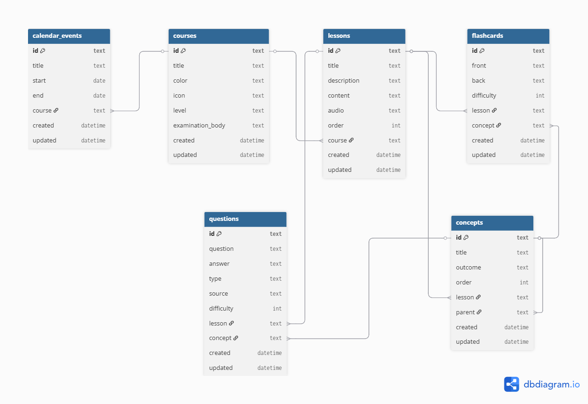

# 🧠 Fundeka Database

This repository hosts the **PocketBase backend** for the Fundeka learning platform.  
It defines the database schema, manages migrations, and serves as the data layer powering the Fundeka app.

---

## 📦 Overview

This project provides:
- A **Dockerized PocketBase** instance for easy deployment and portability.
- The **database schema backup** (collections definitions) stored as JSON and DBML in the `backup/` folder.
- A **`principal/`** folder containing scripts and utilities (currently a Deno project) for populating or maintaining the database.
- A **visual schema** (`schema.png`) describing the data model.

---

## 🧩 Repository structure

```

.
├── Dockerfile                # PocketBase Docker setup
├── pb_migrations/            # PocketBase migrations (schema evolution)
├── pb_data/                  # Runtime database files (ignored in Git)
├── principal/                # Deno project for data population / automation
├── pb_schema.json            # Exported PocketBase schema
├── fundeka_schema.dbml       # DBML representation of the schema
├── schema.png                # Visual database diagram
└── README.md

````

---

## 🐳 Running PocketBase with Docker

Run the PocketBase instance using the following command:

```bash
docker run -p 8080:8080 \
  -v $(pwd)/pb_data:/pb/pb_data \
  fundekamaterial
````

* **Port 8080** exposes the PocketBase web dashboard.
* **`pb_data/`** is mounted locally for persistence of data and uploaded files.
* The **Docker image** is built using `alpine` for minimal size.

To build the image yourself:

```bash
docker build -t fundekamaterial .
```

Then start it:

```bash
docker run -p 8080:8080 -v $(pwd)/pb_data:/pb/pb_data fundekamaterial
```

PocketBase will be available at:
👉 [http://localhost:8080](http://localhost:8080)

---

## 🧠 Database schema

The Fundeka database is organized into logical entities:

| Collection          | Description                                                                |
| ------------------- | -------------------------------------------------------------------------- |
| **courses**         | Top-level subjects like Mathematics, Science, etc.                         |
| **lessons**         | Topics within a course; contains rich text content and optional audio.     |
| **concepts**        | Key ideas within a lesson; supports hierarchical relationships (`parent`). |
| **flashcards**      | Interactive study cards linked to lessons and concepts.                    |
| **questions**       | Quiz or test items linked to lessons and concepts.                         |
| **calendar_events** | Course-related events (tests, deadlines, etc.).                            |

Visual representation:



A DBML version (`fundeka_schema.dbml`) is included for import into [dbdiagram.io](https://dbdiagram.io) or similar tools.

---

## 🚫 Ignored files

* `pb_data/` is **gitignored** to prevent committing runtime data and uploads.
* This folder will be recreated when you run PocketBase locally.

If you wish to persist migrations or schema changes between environments, make sure to commit only:

* `pb_migrations/`
* `pb_schema.json`

---

## 🔄 Migrations

The `pb_migrations/` directory (if populated) allows schema evolution tracking.
PocketBase automatically reads and applies migrations on startup.

> 📝 **Note:**
> If your workflow relies on exporting and importing schema JSON files instead of migrations, you can regenerate migrations at any time using:
>
> ```bash
> ./pocketbase migrate
> ```

---

## 🧰 The `principal/` folder

This folder contains a Deno project currently used to:

* Seed the database with course and lesson content.
* Automate imports from markdown or external data sources.

> ⚙️ This logic will evolve over time — future updates may replace it with a Go or Node-based data population script.

---

## 🧾 Licensing & Contribution

This repository is part of the **Fundeka Project**.
Direct modifications to the schema should be done with care to maintain compatibility with the main app.

Pull requests are welcome for:

* Schema improvements
* Migrations cleanup
* Documentation or tooling enhancements

---

## 📫 Contact

For questions or contributions, reach out to **Munyaradzi Chiwundura**.
📧 [mchiwundura@protonmail.com](mailto:mchiwundura@protonmail.com)
🌍 Makhanda, South Africa

---

> *“Make learning, Effortless.”* — **Fundeka**

